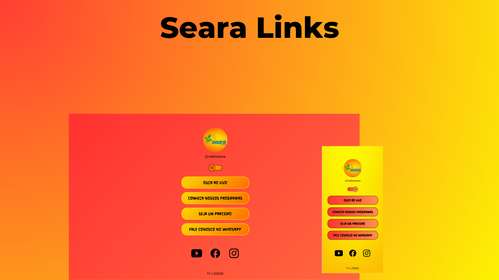

<h1 align="center"> Seara Links </h1>

Web – site contendo os principais Links da Rádio Seara. 

  <a href="#-tecnologias">Tecnologias</a>&nbsp;&nbsp;&nbsp;|&nbsp;&nbsp;&nbsp;
  <a href="#-projeto">Projeto</a>&nbsp;&nbsp;&nbsp;|&nbsp;&nbsp;&nbsp;
  

  

 

  

## Tecnologias

Esse projeto foi desenvolvido com as seguintes tecnologias:

- HTML e CSS
- JavaScript
- Git e Github
- Canva

## Projeto

O Seara Links é um agregador de links para usar como cartão de visitas online, com intuito de levá-lo(a) onde quiser ir dentro do ecossistema de redes sociais, páginas, site e contatos.

- [Acesse o projeto finalizado, online])

---
